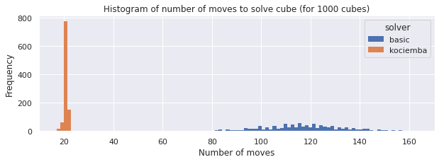
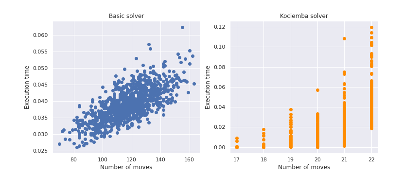

# RubiksCube Simulator

This project is a small app to vizualise and manipulate a RubiksCube.

It started as a toy project to learn OpenGL, but somehow turn into something much bigger.

Main features:
 - 3D vizualisation of a RubiksCube
 - Move any face of the RubiksCube
 - Navigate Camera around cube.
 - Get standard cube representation
 - Solve the cube with (currently) two solvers
    - [Kociemba](https://github.com/muodov/kociemba) Solver
    - Handmade solver mimicing basic human resolution (1st / 2nd crown, yellow cross...)
    

## Code structure

The code is split in 3 main parts :
 - The **model**, under `rubiks_cube/`, contains the main objects (encapsulated in the `RubiksCube` class)
to represent a RubiksCube, move faces, switch between different representations etc...
    - Inside the `solvers/` package are the implementations of the solvers mentionned above, 
      and a `test.py` script to benchmark them.
 - The UI, which is split in two:
    - The main OpenGL window (`opengl_app.py`), which contains the 3D representation of the RubiksCube.
    - The control panel (`controls_panel.py`), using tkinter, which lets the user move the cube faces, the camera, 
      and gives access to the solvers' solutions.
  - An EventHub (`event_hub.py`) which is meant to receive and dispatch events on a rather high level. 
    This is very useful because it allows easy communication between the two UIs and the model 
    even though they don't run in the same thread.
  

## Solvers

Here are some self-explaining charts about each solver's performance.

